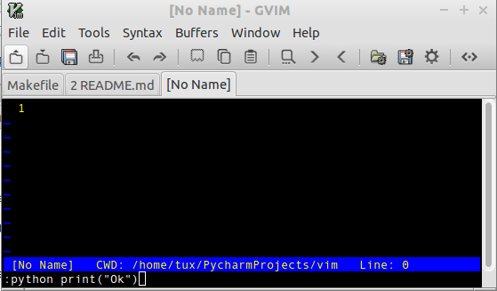
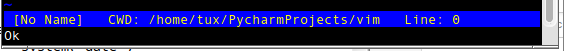

# VIM Script Reference Sheet

<!--

@TODO:  Add more examples.

-->


<!-- START doctoc generated TOC please keep comment here to allow auto update -->
<!-- DON'T EDIT THIS SECTION, INSTEAD RE-RUN doctoc TO UPDATE -->
**Table of Contents**  *generated with [DocToc](https://github.com/thlorenz/doctoc)*

- [VIM Script Reference Sheet](#vim-script-reference-sheet)
  - [VIM SCRIPT](#vim-script)
    - [Path to Current Buffer](#path-to-current-buffer)
      - [Show Current Buffer File](#show-current-buffer-file)
      - [Insert Current Buffer File Path at cursor position](#insert-current-buffer-file-path-at-cursor-position)
    - [Pipe Shell Command to New Buffer](#pipe-shell-command-to-new-buffer)
    - [Set Map Keys](#set-map-keys)
    - [Useful Commands](#useful-commands)
  - [Python Integration](#python-integration)
    - [Enter Python Commands in VIM](#enter-python-commands-in-vim)
    - [Exploring Python](#exploring-python)

<!-- END doctoc generated TOC please keep comment here to allow auto update -->

<!--
    VIM Editor Reference Card
-->


VIM DOC: http://vimdoc.sourceforge.net/htmldoc/ 

## VIM SCRIPT

### Path to Current Buffer

#### Show Current Buffer File 

File Full Path of current buffer:  


```vim
:echo expand("%:p")      
    /home/tux/Downloads/test.sh 
```                         

Full path to directory containing the file


```vim
:echo expand("%:p:h")    
    /home/tux/Downloads
```

Example:

```vim
nmap <F10> :echo expand('%p:h') <CR>
```

#### Insert Current Buffer File Path at cursor position

```vim
:put = expand('%:p')
:put = expand('%:p:h')
```

### Pipe Shell Command to New Buffer

The charcater (#) is replaced by the current file name

```vim
:new | r ! <shell command>
:new | r ! <shell command> #  
```

Example:

```vim
:new | r ! git log
```

```vim
:new | r ! file #
```

### Set Map Keys

```vim
nmap <F10> :clist<CR>
nmap <F11> :cprev<CR>
nmap <F12> :cnext<CR>
```

### Useful Commands


**Create Commands**


It will show the current date in the consolee

```vim
:command! Today :echo stftime("%c")

:Today 
```


**Current Date**

Insert current date in current buffer

```vim
function! InsertDate ()
    let Today = system("date")
    :put = Today
endfunction

:call InsertDate()
Dom Mai 31 21:10:35 BRT 2015
```

## Python Integration

### Enter Python Commands in VIM

```
:python print("Ok")
```




Output:

```
Ok
```




### Exploring Python

```
:py import sys
:py print(sys.excutable)
/usr/bin/python

:py import vim
:py print dir(vim)
['Buffer', 'Dictionary', 'Function', 'List', 'Options', 'Range', 'TabPage', 'VAR_DEF_SCOPE', 'VA
R_FIXED', 'VAR_LOCKED', 'VAR_SCOPE', 'VIM_SPECIAL_PATH', 'Window', '_Loader', '__doc__', '__name
__', '__package__', '_chdir', '_fchdir', '_find_module', '_get_paths', '_getcwd', '_load_module'
, 'bindeval', 'buffers', 'chdir', 'command', 'current', 'error', 'eval', 'fchdir', 'find_module'
, 'foreach_rtp', 'options', 'os', 'path_hook', 'strwidth', 'tabpages', 'vars', 'vvars', 'windows
']                                                        


```
